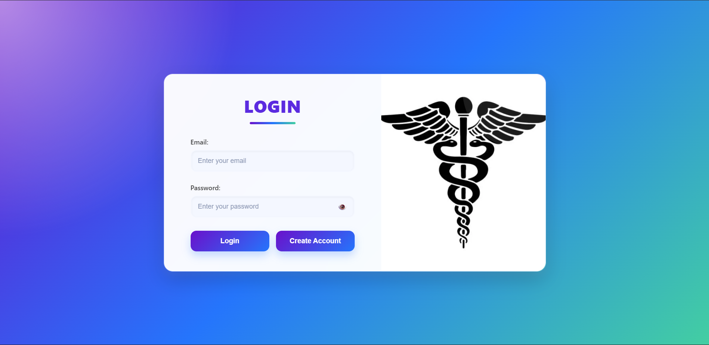
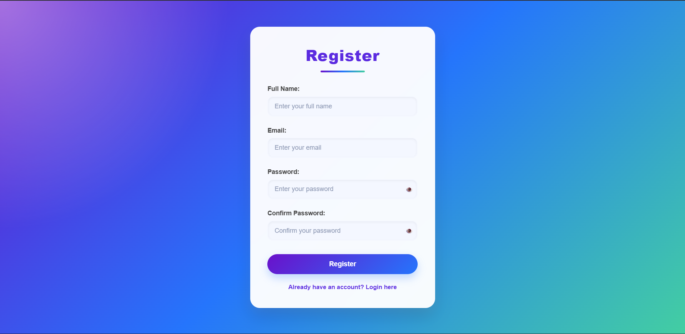
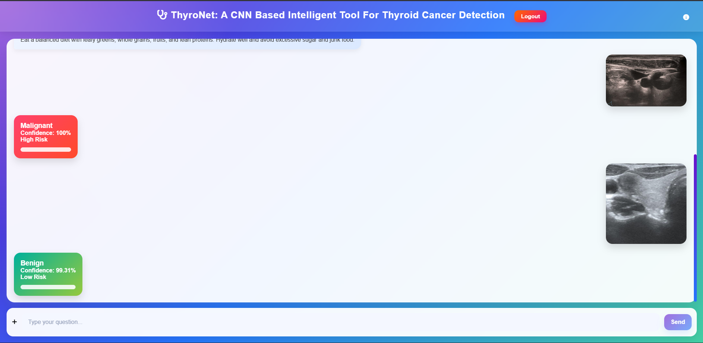
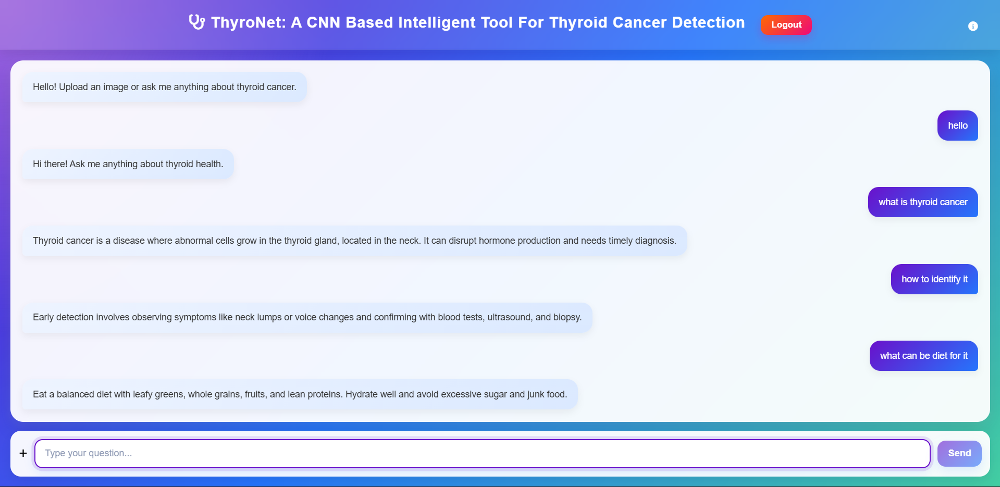
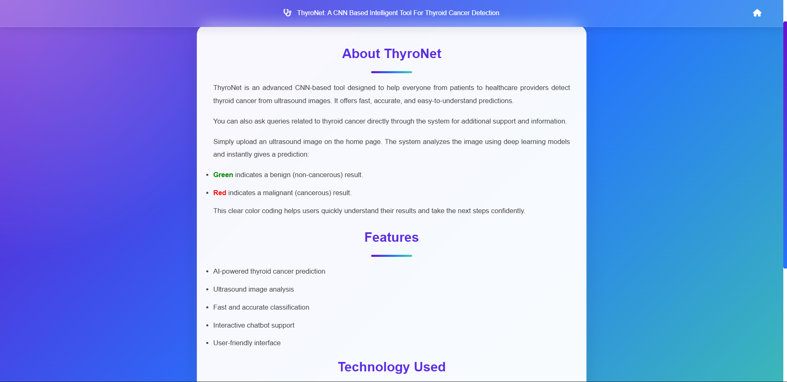

# 🧠 ThyroNet: A CNN-Based Intelligent Tool for Thyroid Cancer Detection

ThyroNet is a full-stack AI-powered web application developed for detecting thyroid cancer from ultrasound images using Deep Learning techniques. The project combines a CNN-based classification model with a Flask backend and a Node.js authentication system. It also includes an intelligent medical chatbot to answer thyroid-related health queries.

---

# 📌 Key Features

## 🧪 CNN-Based Thyroid Cancer Detection
- Detects whether a thyroid ultrasound image is:
  - Benign
  - Malignant
- Built using Convolutional Neural Networks (CNN)

---

## 🤖 Intelligent Medical Chatbot
- Provides answers to thyroid-related queries
- Uses SentenceTransformers for semantic similarity matching
- Interactive chatbot interface

---

## 🔐 Authentication System
- Login and Registration system
- Built using:
  - Node.js
  - Express.js
  - MongoDB

---

## 📊 Model Evaluation
- Calculates:
  - Accuracy
  - Precision
  - Recall
  - F1-Score

---

## 📤 Image Upload & Prediction
- Upload thyroid ultrasound images
- Displays:
  - Prediction result
  - Confidence score
  - Risk level

---

## 💬 Interactive User Interface
- Modern chatbot-style interface
- Real-time image preview
- Loading indicators
- Result cards

---

# 🛠️ Technologies Used

## Frontend
- HTML
- CSS
- JavaScript

## Backend
- Flask (Python)
- Node.js
- Express.js

## Database
- MongoDB

## AI / Deep Learning
- PyTorch
- CNN
- SentenceTransformers

---

# 🗂️ Project Structure

```plaintext
Thyroid-Cancer-Detector/
│
├── app.py                     # Flask AI backend
├── intents.json               # Chatbot intents
├── requirements.txt           # Python dependencies
├── app.log                    # Application logs
│
├── templates/
│   ├── index.html             # Main AI dashboard
│   └── about.html             # About project page
│
├── frontend/
│   ├── form.html              # Login page
│   ├── register.html          # Registration page
│   ├── form1.css              # Login CSS
│   ├── register.css           # Register CSS
│   ├── server.js              # Node.js authentication server
│   └── photo/
│       └── caduceus.jpg
│
├── models/                    # CNN model files
├── classifier/                # Classification training scripts
├── uploads/                   # Uploaded images
├── utils/                     # Utility functions
└── cnn_classifier.pth         # Trained CNN model
---

## 🚀 How to Run the Project

### Step 1: Clone the Repository

```bash
git clone https://github.com/venkatrao7/Thyroid-Cancer-Detector.git
cd Thyroid-Cancer-Detector
````

---

### Step 2: Run Flask Backend

```bash
# (Create a virtual environment if needed)
#Install Python dependencies:
pip install -r requirements.txt
python app.py
```

This runs the backend on:
👉 `http://127.0.0.1:5000`

---

### Step 3: Run Node.js Frontend (Login/Register)

```bash
cd frontend
npm install
node server.js
```

This runs the frontend on:
👉 `http://localhost:3018/login`


## Application Flow

User Login/Register
        ↓
Node.js + MongoDB Authentication
        ↓
Redirect to Flask AI Dashboard
        ↓
Upload Thyroid Image
        ↓
CNN Prediction
        ↓
Prediction Result + Chatbot Assistance

---

## 🧠 Model Training

To train the classifier:

```bash
python train_classifier.py
```

For U-Net segmentation:

```bash
python train_seg.py
```


## 📎 Requirements

* Python 3.8+
* Flask
* torch, torchvision
* Pillow
* sentence-transformers
* scikit-learn
* Node.js (for frontend)

---
## 🔍 Results
### 1. Login Image


### 2. Register Image


### 3. Benign Image


### 4. Malignant Image


### 5. Chat Interface


### 6. About Interface


## 👩‍💻 Author

**Venkatrao Velagapudi**
B.Tech Graduate-Artificial Intelligence & Machine Learning
Major Project - ThyroNet

---

## 📜 License

This project is for educational and academic use only.

